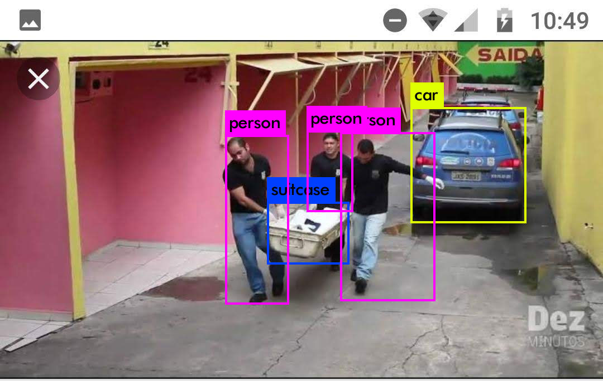

# Cria-o-de-Uma-Base-de-Dados-e-Treinamento-da-Rede-YOLO

Para realizar este projeto  utilizei a rede YOLO, disponível em: https://pjreddie.com/darknet/yolo/.
# Passo a passo:
# Detecção usando um modelo pré-treinado
Clonei o resoitório https://github.com/pjreddie/darknet para meu destktop com linux Mint 21.3 com anaconda instalado. Entrei no diretório *darknet* e madei compilar o código clonado com o comando *make*

<pre><code class="bash">
git clone https://github.com/pjreddie/darknet
cd darknet
make
</code></pre>

# Baixar o arquivo de peso pré-treinado (237 MB).

<pre><code class="bash">
wget https://pjreddie.com/media/files/yolov3.weights
</code></pre>

# Exeutar a detecção

Use uma das figuras que estão no diretório data ou baixe alguma da internet para este diretório e execute o seguinte comando passando o nome da figura a ser analisada

<pre><code class="bash">
./darknet detect cfg/yolov3.cfg yolov3.weights data/dog.jpg
</code></pre>

Usei esta figura do cacchoro que já estava disponível no diretório data e baixei mais duas figuras da internet. Uma da av paulista com carros e ônibus e outra de carros e pesssoas e uma maca com uma pessoa provalvelmente morta.

# Resultados
## Fotos de entrada:
1. Fotos da Av Paulista 
2. Foto com Cacchoro e Bicicleta 
3. Foto de uma morte num Motel 

## Fotos processadas pelo yolo v3
1. Fotos da Av Paulista processada 
2. Foto com Cacchoro e Bicicleta processada 
3. Foto de uma morte num Motel procesada 

